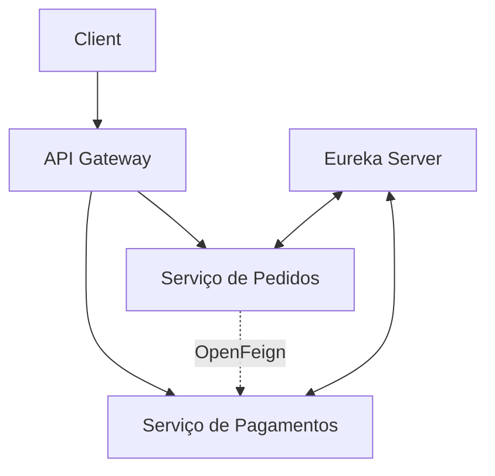

# iFood Clone - Projeto em Microsserviços com Spring Cloud

[](https://www.java.com/)
[](https://spring.io/projects/spring-boot)
[](https://spring.io/projects/spring-cloud)

Este sistema replica funcionalidades básicas do iFood, implementando uma arquitetura de microsserviços com os principais padrões do ecossistema Spring Cloud. O desenvolvimento acompanhou a estrutura do curso da Alura, com adaptações pessoais e implementações adicionais.

## 📚 Conceitos Aplicados (Conteúdo do Curso)

✔ **Service Discovery** - Implementado com Eureka Server  
✔ **API Gateway** - Centralização de rotas com Spring Cloud Gateway  
✔ **Comunicação Síncrona** - Entre serviços usando OpenFeign  
✔ **Resiliência** - Padrão Circuit Breaker com Resilience4j  
✔ **Migrations** - Controle de versão do banco com Flyway  
✔ **DTO Pattern** - Isolamento da API usando ModelMapper  

## ⚙️ Arquitetura do Sistema


## 🧩 Módulos Implementados

| Serviço           | Tecnologias-Chave                          | Descrição                                  |
|--------------------|-------------------------------------------|-------------------------------------------|
| **Eureka Server**  | Spring Cloud Netflix Eureka               | Registro e descoberta de microsserviços   |
| **Gateway**        | Spring Cloud Gateway, Load Balancer       | Roteamento e balanceamento de carga       |
| **Pedidos**        | Spring Data JPA, MySQL, Flyway            | Gestão do ciclo de vida dos pedidos       |
| **Pagamentos**     | OpenFeign, Resilience4j, ModelMapper      | Processamento de pagamentos com resiliência|

## 🛠 Tecnologias Utilizadas

- **Backend**: Java 17, Spring Boot 2.6.7
- **Banco de Dados**: MySQL com migrações controladas por Flyway
- **Cloud**: Spring Cloud 2021.0.2 (Eureka, Gateway, OpenFeign)
- **Resiliência**: Circuit Breaker com Resilience4j
- **Produtividade**: Lombok, ModelMapper

## 🔍 O Que Aprendi (Key Takeaways)

- **Padrões arquiteturais**: Diferenças entre monólito e microsserviços
- **Service Discovery**: Como serviços se registram e descobrem dinamicamente
- **Comunicação entre serviços**: Implementação de chamadas REST síncronas
- **Tolerância a falhas**: Configuração de fallbacks e circuit breakers
- **Gateway Pattern**: Centralização de rotas e cross-cutting concerns

## 🚀 Como Executar

1. **Clone o repositório**:
   ```bash
   git clone https://github.com/Kic-Xp/kicfood-microsservicos
   cd kicfood-microsservicos
   ```

2. **Inicie os serviços na seguinte ordem**:

   OBS: Caso não tenha o Maven instalado, troque o mvn por ".\mvnw" dentro da pasta do projeto.

   a) **Service Discovery (Eureka Server)**:
   ```bash
   cd server
   mvn spring-boot:run
   ```
   *Verifique em: http://localhost:8761*

   b) **API Gateway** (em novo terminal):
   ```bash
   cd ../gateway
   mvn spring-boot:run
   ```

   c) **Microsserviços** (em terminais separados):
   ```bash
   # Microsserviço de Pagamentos
   cd ../pagamentos
   mvn spring-boot:run

   # Microsserviço de Pedidos
   cd ../pedidos
   mvn spring-boot:run
   ```

4. **Acesse a aplicação**:
   - O gateway estará disponível em: `http://localhost:8080`
   - Os endpoints individuais estarão disponíveis nas portas padrão de cada serviço
